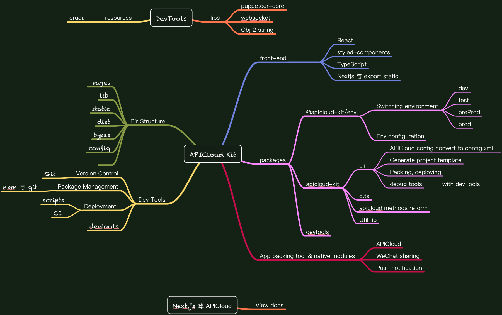

# APICloud Kit

### Why I start this project.

I am a front-end developer, and my boss asked me to develop mobile apps running on iOS and Android with my knowledge.

Well, it can only be done with developing hybrid apps. So after searching on the web, I finally found a technology called [APICloud](https://www.apicloud.com).

I built some demo apps following the instructions from the site, and was impressed with its simplicity. I have tried some other technology on building hybrid apps, and always struggled with the packing progress. With APICloud, however, you are not required to install `Xcode` or `Android Studio` onto your developing enviroment. It builds your app just on their server. You are of course not required to know anything about native languages such as `Object-C` / `Swift` or `Java`.

But it just not that perfect. After diving into this technology for months, shortcomings are found.

**_APICloud is just like a traditional Chinese Internet Technology Company_**

As a developer from China, what I feel strongly is that **many Chinese Internet companies don't feel like embracing open source and GitHub community**. They prefer to build a close environment for developers. They talk within their old-fashion self-built forums, group chats in WeChat or QQ, where always filled with unrelated, useless messages. And I always waste too much time on searching for solutions.

Secondly, even if it's in 2019, `jQuery-like` and `ES5` are still preferred by APICloud. They of course has little contribution on improving developing experience. No automation tool chains. No `d.ts`. Just old-fashion ways.

They just not follow the main stream of the envolution of front-end development.

So, this project is an attempt to offer some _MODERN_ ways for developing hybrid apps using APICloud.

### Mind Map

### What can you do?

-   Configure the project with ease.
-   Write all code in TypeScript with auto completion and intelligence.
-   Use async apis with `Promise`, `async / await`.
-   Use [React](https://reactjs.org), and keep away from manual DOM manipulation.
-   Use [Next.js](https://nextjs.org/docs#static-html-export) with _static HTML export_.
-   Use CSS-in-JS with [styled-components](https://www.styled-components.com/).
-   Use even more convenient `page.ts` to configure your page structure.
-   Use `navigateTo` method and stop manually `openWin`.
-   Use `@apicloud-kit/env` to manage your environment with ease.

### What can you do in a short time?

-   [ ] Use `@apicloud-kit/devtools` to debug your hybrid app with ease.
-   [ ] Debug in browser with ease.

## Explaination

### Using React with Next.js

Developing APICloud apps is not to build an SPA, however, it requires you to create a bunch of pages (or entries). Every single page(or window) open in the app, is like a new tab in the browser. They are isolated, each have their own JavaScript runtime, and can only communicate via native methods, which are provided by APICloud.

**Static HTML export** from Next.js, therefore, is just perfectly fit with APICloud development. It can simply generate HTML files for each _window_. React is also an amazing UI library for web development, with the power of JSX and TypeScript. Additionally, we can replace official React.js with [Preact](https://preactjs.com/) or [Anujs](https://github.com/RubyLouvre/anu), which are smaller and faster than the official one.

In this scenario, we don't use the server-side rendering feature of Next.js. We fetch the dynamic data from the server just inside the client. In this case, browser can load the static part of the page in advance, leaving the dynamic one loading with a loading indicator, instead of displaying a dazzling white blank page on screen.

For some simple and tiny frames, we could just not load JavaScript files, especially files like react.js of big size, reducing its loading time.

More optimizations for APICloud development using React with Next.js list below.

-   TODO
-   TODO

### Configuring Project with Ease

The Configuration of an APICloud project is verbose and frustrating. You are required to edit the [`config.xml`](https://docs.apicloud.com/Dev-Guide/app-config-manual) file in your local project, and upload certificates on their management page. Now, you can only fill up a `project.config.ts` in your local project, leaving the rest of work to the automation scripts.

Packing and downloading your app is also one command away.

### Using DevTools

#### Inspecting in your browser such as Chrome

For hybrid apps always coming with native methods, normally you cannot inspect your web page in your browser with the power of Chrome's DevTools.

APICloud Kit, however, just simply substitutes the native methods with **browser compatible** ones depending on the environment. For example, a _location redirecting_ just subsitutes an `openWin()`, and a `window.alert()` subsitutes an `api.alert()`, e.g.

#### Remote DevTool for Hybrid App Development

Using Chrome's DevTools is good, but what if there is no subsitutions in the ordinary browser environment? For example, _push notification_, _sharing to social apps_, e.g.

Remote DevTool just solves this problem.

It has 3 parts:

-   Intercepter, runs inside the app, intercepting the native JavaScript methods like `console.log()`, `alert()` and `XMLRequest`, sending messages to the _Monitor_ via WebSocket, can execute scripts from Monitor, sending back afterwards.
-   Monitor, runs on the development machine, receiving and displaying messages from the _Intercepter_, can also send scripts to the Intercepter.
-   Server Side, empowered by a nodeJS server with WebSocket, responsible for connecting the two parts above.

This tool is inspired by [Eruda](https://github.com/liriliri/eruda), a console for Mobile Browsers.

You can now debug, and inspect the element tree on your development machine without your phone pluged in. This is the key to make develop hybrid apps more efficient and painless.
